# **Cameras**

Hardware Ecosystem

---

# Contents

- Map of existing packages
- Different integration strategies
- Planned roadmap
- Questions

---

<style>
img[alt~="top-right"] {
  position: absolute;
  top: 30px;
  right: 30px;
  width: 80%
}
</style>



<style scoped>section { justify-content: flex-end; }</style>

# Camera Packages

Grouped by technology integration

---

# OpenCV

- [FeatherScope](https://github.com/FeeLab/Bonsai.FeatherScope/blob/master/Bonsai.FeatherScope/FeatherScope.cs)
- [Miniscope#Helpers](https://github.com/open-ephys/bonsai-miniscope/blob/main/OpenEphys.Miniscope/Helpers.cs)

```c#
using OpenCV.Net;

using (var capture = Capture.CreateCameraCapture(Index))
{
    // set any camera properties
    capture.SetProperty(CaptureProperty.Gain, SensorGain);

    // frame grabber loop
    while (!cancellationToken.IsCancellationRequested)
    {
        var image = capture.QueryFrame();
        if (image == null)
        {
            observer.OnError(new InvalidOperationException("Unable to acquire camera frame."));
            break;
        }
        else observer.OnNext(image.Clone());
    }
}
```

---

# DirectShow

Legacy media-streaming architecture for Microsoft Windows.

- [Video package](https://github.com/bonsai-rx/video): uses the AForge library as a DirectShow access layer. Good compatibility with legacy capture cards and webcams but no plan to upgrade.

---

# Vendor SDK

- Focused on data streaming API
- Camera configuration in vendor GUI
  - Trigger modes
  - Binning
  - Exposure
  - ...
- Extra frame metadata:
  - Frame counter
  - Hardware timestamp
  - GPIO lines

---

# Vendor SDK

- [Spinnaker](https://github.com/bonsai-rx/spinnaker/blob/d4f540297a262b49a26e055e580a2d19e81cbb74/Bonsai.Spinnaker/SpinnakerCapture.cs#L138) (FLIR)
- [Pylon](https://github.com/bonsai-rx/pylon/blob/1509b77f4bafbc657f296d4d864468e7bcaaf1ed/Bonsai.Pylon/PylonCapture.cs#L145) (Basler)
- [Vimba](https://github.com/bonsai-rx/vimba/blob/f505ca80f55b0be10662209ceb99338e84a13f4d/Bonsai.Vimba/VimbaCapture.cs#L83) (AVT)
- [uEye](https://github.com/bonsai-rx/ueye/blob/deda239bc869cea6b911affd2a57d51658482e54/Bonsai.uEye/uEyeCapture.cs#L25) (IDS)

---

# GenICam

The goal of GenICam® (Generic Interface for Cameras) is to provide a generic programming interface for all kinds of devices (mainly cameras), no matter what interface technology (GigE Vision, USB3 Vision, CoaXPress, Camera Link HS, Camera Link etc.) they are using or what features they are implementing.


The result is the application programming interface (API) will be identical regardless of interface technology.

---

# GenICam

## Pros
- Incredible concept in principle
- Virtually every single industry vendor is a [member](https://www.emva.org/our-members/members/)
- Existing generic camera streaming software is available

## Cons

- Opaque client API provenance (where to download?)
- Poor code samples (none)
- Unclear licensing requirements (may have to become member of EMVA)

---

# [Emergent Vision Technologies](https://emergentvisiontec.com/)

- 10 GigE / 25 GigE / 100 GigE cameras
- Example: 25 GigE HB-7000-S (3208 x 2200 @ 200fps)
- Example: 100 GigE HZ-65000-G (9344 x 7000 @ 70fps)
- Prohibitive to acquire and manipulate raw frames in memory

---

# All GPU approach
- [NVIDIA GPUDirect](https://developer.nvidia.com/gpudirect) (grabber)
- [NVIDIA Video Codec SDK](https://developer.nvidia.com/video-codec-sdk) (compression)
- [NVIDIA DALI](https://github.com/NVIDIA/DALI) (inference)

---

# Questions

- Vendor-specific or generic camera interfaces (e.g. GenICam)
- How best to resolve development bottleneck:
  - many packages remain unpublished due to lack of hardware
  - coordinating testing / maintenance / review contributions
  - distribute hardware vs distribute developers
- State-of-the-art technologies require focused and integrated development teams:
  - how best to support / fund these efforts?
  - currently ad-hoc contributions from individual developers at single institutions
  - need coordinated sustained effort to implement and maintain entire stack